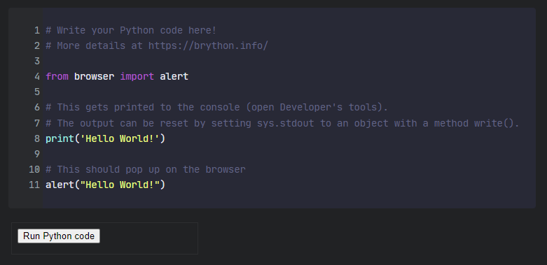

# brython-run - a widget for SiYuan

Inspired by the widgets [brython-editor](https://github.com/Zuoqiu-Yingyi/widget-brython-editor) and [brython-console](https://github.com/Zuoqiu-Yingyi/widget-brython-console), here's [brython-run](https://github.com/eulores/siyuan-brython-run)

Python code is written inside code sections in [SiYuan](https://b3log.org/siyuan/en/), and executed at the press of a button.

## Installation

Right now, the widget can be manually installed by copying this directory into the /data/widgets folder of your SiYuan installation.

## Screenshot

